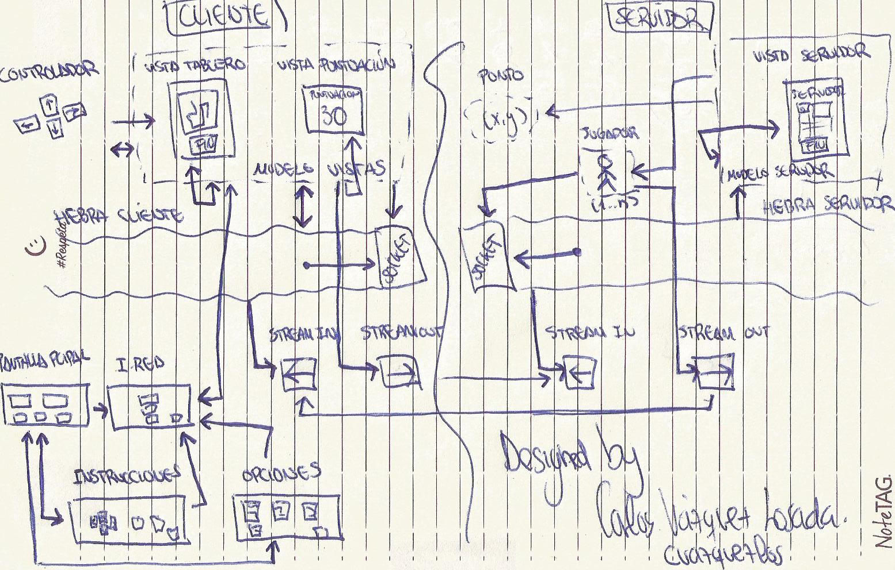

# Snake game

## Castellano 

Simulación del famoso juego desarrollado por Gremlin en los mediados de la década de los 70 y que fue añadido más tarde, en 1998, en los móviles Nokia. Esta implementación se encuentra desarrollada en el lenguaje de Java y como pilar fundamental de esta implementación son los Patrones de Diseño utilizados.

Consta de un conjunto de clases divididas en la parte del Cliente y la parte del Servidor. Cada uno de ellos posee un socket (el del servidor acepta las conexiones y el del cliente las solicita), una hebra que recibe los mensajes del servidor y del cliente y una clase que los envía (streamIn y streamOut, en Cliente y Servidor). La relación entre todas las clases se encuentra en el siguiente dibujo, el cual realicé al comenzar con el proyecto:

